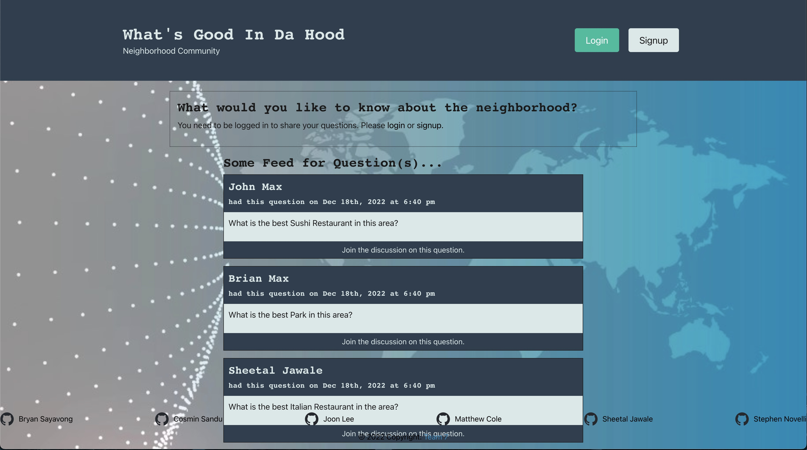
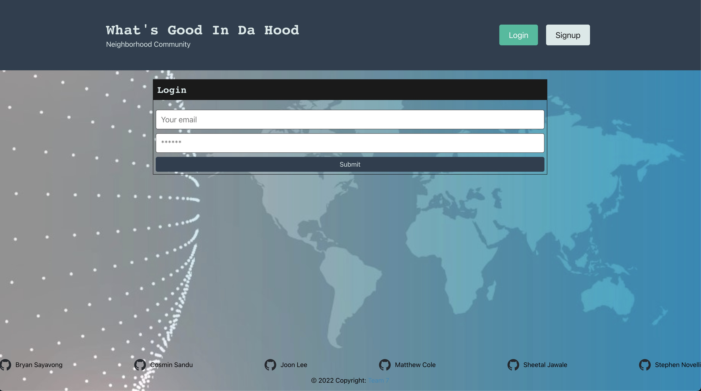
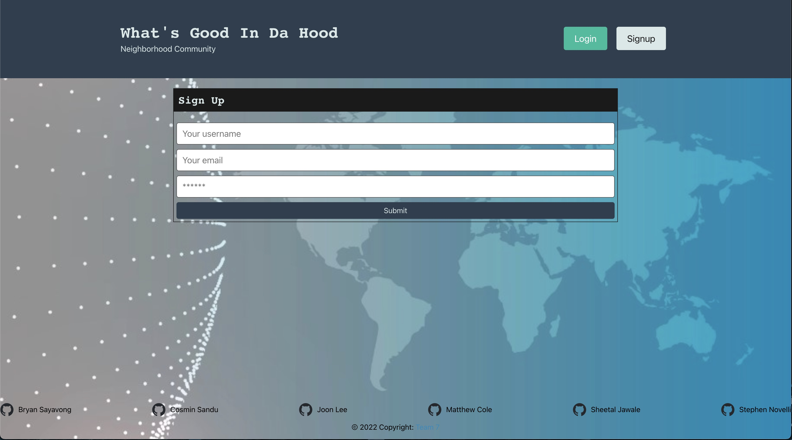

# What's Good in the Hood?
    

## Description
"What's Good in the Hood" is a community forum where you can find local reccomendations for the best attractions in your area. Interact with your neighborhood and connect over your love of parks, coffee, restaurants and more!
## Screenshots
Home Page   
Login   
Sign Up   
## Demo
Click [here](https://drive.google.com/file/d/1YW5KqrrU7XUoo2wmXF1ihFi4gq7qHjmw/view) to view a demo of the application.
## Live Site
[What's Good in the Hood?](https://goodhood-bootcamp.herokuapp.com)

## Contributors
[Bryan Sayavong](https://github.com/Bsayavong) 
[Cosmin Sandu](https://github.com/csandu123) 
[Joon Lee](https://github.com/jleebootcamp) 
[Matthew Cole](https://github.com/mncole98) 
[Sheetal Jawale](https://github.com/sheetaljwl795) 
[Stephen Novelli](https://github.com/snovelli1021) 